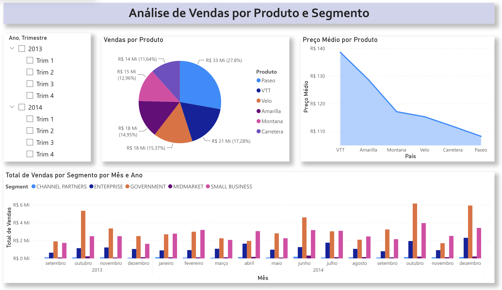
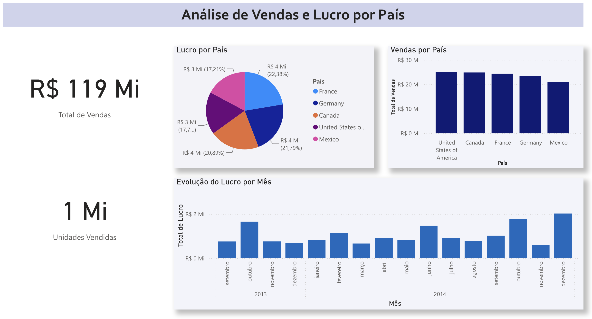
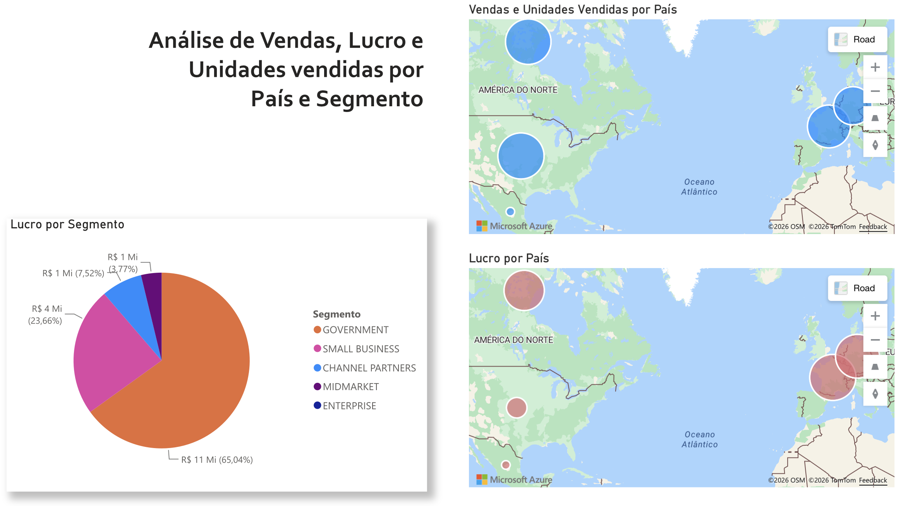

# Análise de Vendas com Power BI

> Dashboard desenvolvido como parte de um desafio prático da DIO, com foco na criação, organização e apresentação de visualizações de dados no Power BI.

## Sobre o projeto

Este projeto foi desenvolvido a partir da **amostra de dados disponibilizada pela DIO**, com o objetivo de praticar a criação e organização de relatórios no Power BI.

O relatório apresenta análises relacionadas a vendas, lucro, produtos, segmentos e distribuição geográfica, organizadas em três páginas.

As duas primeiras páginas foram desenvolvidas com base nas atividades realizadas durante o curso. A terceira página foi construída como parte do desafio proposto, reunindo visualizações de vendas, unidades vendidas, lucro por país e lucro por segmento.

## Dashboard

### 1. Análise de Vendas por Produto e Segmento

A primeira página apresenta análises relacionadas ao desempenho dos produtos e segmentos, incluindo vendas, preço médio e evolução temporal.

### 2. Análise de Vendas e Lucro por País

A segunda página concentra indicadores financeiros e análises geográficas, permitindo observar vendas, unidades vendidas e lucro por país.

### 3. Análise de Vendas, Lucro e Unidades Vendidas por País e Segmento

A terceira página foi desenvolvida especificamente para o desafio e apresenta:

- vendas e unidades vendidas por país;
- lucro por país;
- distribuição do lucro por segmento.

## Arquivo da apresentação

O relatório também foi exportado para PowerPoint para facilitar a visualização e o compartilhamento das páginas desenvolvidas.

[Visualizar apresentação do relatório](presentation/analise-de-vendas.pptx)

## Fonte dos dados

O projeto foi desenvolvido a partir da sample disponibilizada no material do desafio da DIO.

Repositório de referência:

[power_bi_analyst — Juliana Zanelatto](https://github.com/julianazanelatto/power_bi_analyst)

## Principais aprendizados

Este projeto representou meu primeiro contato prático com o Power BI e foi desenvolvido a partir do zero, desde a familiarização com a interface até a construção e organização de um relatório completo.

Ao longo do processo, aprendi a trabalhar com diferentes tipos de visualização, compreender a função dos campos utilizados em cada gráfico e escolher formas mais adequadas de apresentar as informações disponíveis.

Também desenvolvi conhecimentos relacionados à:

- criação e configuração de gráficos, mapas, cartões e segmentações;
- organização de páginas e distribuição dos elementos no dashboard;
- escolha de visualizações de acordo com o tipo de informação analisada;
- configuração de agregações, filtros e dicas de ferramentas;
- padronização de títulos, rótulos, unidades e formatos monetários;
- análise de dados por produto, segmento, país e período;
- publicação, exportação e compartilhamento de relatórios.

Um dos principais aprendizados foi perceber que a construção de um dashboard vai além da inserção de gráficos. É necessário compreender qual informação se deseja destacar, quais dados devem ser utilizados e como organizar os elementos para tornar a análise mais clara e objetiva.

A criação da terceira página foi especialmente importante nesse processo, pois exigiu maior autonomia para selecionar os campos, configurar os visuais e estruturar a análise a partir dos requisitos definidos no desafio.

Como continuidade dos estudos, pretendo aprofundar conhecimentos em **modelagem de dados, Power Query, DAX e construção de indicadores mais avançados**, ampliando gradualmente as possibilidades de análise dentro do Power BI.

## Autor

**Larissa Santos**
