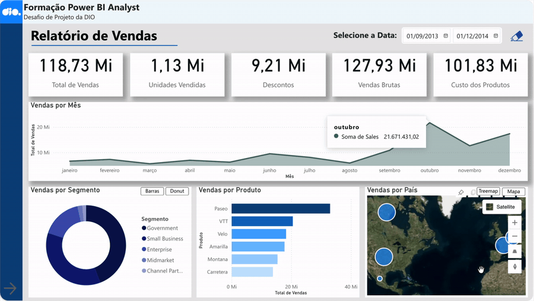
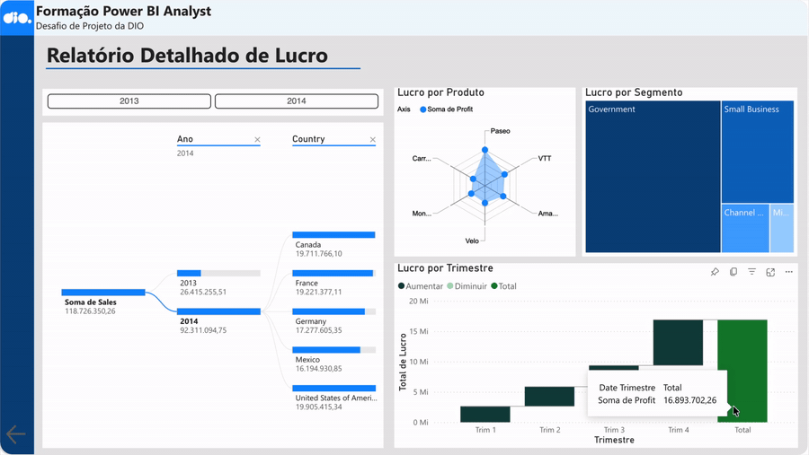

# Relatório Gerencial de Vendas com Power BI

> Projeto desenvolvido como parte de um desafio prático da DIO, com foco na criação de um relatório gerencial interativo utilizando recursos de navegação, segmentação e alternância entre visualizações no Power BI.

## Sobre o projeto

Este projeto foi desenvolvido a partir da **Financial Sample** disponibilizada no repositório [power_bi_analyst — Juliana Zanelatto](https://github.com/julianazanelatto/power_bi_analyst), utilizado como referência no desafio da DIO.

O objetivo foi construir um relatório gerencial de vendas mais elaborado, explorando não apenas a apresentação dos dados, mas também recursos de interação e navegação.

O relatório foi estruturado em duas páginas, permitindo analisar diferentes perspectivas dos dados de vendas e lucro de forma dinâmica, com uso de filtros, indicadores, ações e alternância entre visualizações.

## Objetivos

- desenvolver um relatório gerencial de vendas com maior nível de interatividade;
- organizar as informações de forma clara e funcional;
- permitir diferentes formas de exploração dos dados;
- implementar navegação entre páginas e visualizações;
- publicar o relatório no Power BI Service.

## Dashboard

### Página 1 — Relatório de Vendas

A primeira página apresenta uma visão geral dos principais indicadores de vendas, permitindo acompanhar o desempenho por período, produto, segmento e país.

Também foram implementados recursos para aplicação de filtros e alternância entre diferentes formas de visualização.

### Página 2 — Relatório Detalhado de Lucro

A segunda página amplia a análise com foco no desempenho financeiro, apresentando o lucro sob diferentes perspectivas, como produto, segmento, período e localização.

## Recursos de interatividade

O relatório utiliza diferentes recursos do Power BI para tornar a experiência de análise mais dinâmica:

- segmentadores de dados;
- indicadores (bookmarks);
- ações associadas a botões, imagens e formas;
- alternância entre diferentes visualizações;
- navegação entre páginas;
- atualização dinâmica dos visuais conforme os filtros aplicados.

Os GIFs apresentados acima demonstram parte dessas interações diretamente no relatório.

## Principais aprendizados

Este projeto permitiu avançar da criação de visualizações isoladas para a construção de um relatório mais estruturado e interativo.

Um dos principais aprendizados foi compreender como diferentes recursos do Power BI podem trabalhar em conjunto para controlar a experiência de navegação e a apresentação das informações. A utilização de indicadores foi especialmente importante para entender como diferentes estados de uma mesma página podem ser armazenados e utilizados para alternar visualizações sem a necessidade de criar páginas adicionais.

Também foi possível aprofundar a compreensão sobre organização de camadas e objetos, comportamento dos filtros, configuração de ações e estruturação visual do relatório.

O desenvolvimento reforçou ainda a importância de pensar no dashboard sob a perspectiva de quem irá utilizá-lo. Além da escolha dos gráficos, é necessário considerar a hierarquia das informações, a facilidade de navegação e a forma como cada interação contribui para tornar a análise mais clara e intuitiva.

## Autor

**Larissa Santos**
